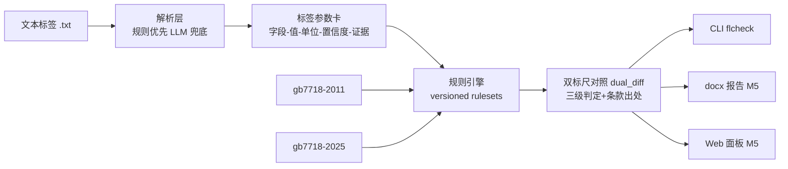

# food-label-compliance-checker

预包装食品标签合规智能审查系统——面向 GB 7718/GB 28050 换版期（新版标准 2025-03-27 发布、2027-03-16 强制实施）的标签审查开源工具：把文本标签解析为结构化"参数卡"，用**双标尺规则引擎**分别按 GB 7718-2011（现行）与 GB 7718-2025（过渡期）审查，输出"现行合规 / 新规不合规"对照，每条结论挂标准条款出处与标签原文证据。

> **项目状态：🚧 骨架阶段（M0）**。计划先行、骨架通电：垂直切片（解析→参数卡→双标尺规则→JSON 结论）已真实可跑；数据生成器（M1）、全量解析（M2）、全量规则与数值复算（M3）、基准评测（M4）、报告/Web（M5）按 [plan/05](plan/05-数据计划与里程碑.md) 里程碑推进。规划中的能力见下文"特性"，**请勿将未标注"已实现"的内容当作可用功能**。

## 特性

**已实现（M0 骨架）**

- 标签参数卡统一中间表示（字段-值-单位-置信度-证据），证据含标签区域+原文逐字摘录+字符偏移
- 最小文本解析器：食品名称 / 净含量 / 生产日期 三个字段示范通路（全量字段 M2）
- 规则集版本化引擎（versioned ruleset）+ 类目隔离门控（`only_if`，对全部检查类型生效）
- **双标尺审查**：`gb7718-2011` 与 `gb7718-2025` 两个规则集跑同一标签，输出 `dual_diff`（新增/消除的不合规项）
- 结论三级判定（合规 / 不合规 / 待人工确认），每条挂标准号+条款号；条款未挂原文核验前自动标"待核对"
- CLI（`flcheck check / parse`）、内置基准占位、CI（{ubuntu, windows} × {3.8, 3.11}）、全离线 pytest

**规划中（按里程碑）**

- M1 合成标签生成器（固定 seed 可复现，注入 8 类已知违规做配对评测）
- M2 全量标签解析（配料表、营养成分表、SC 号、声称、致敏原等）
- M3 数值复算引擎（NRV% 复算、能量系数折算、声称阈值）、全量双标尺规则库
- M4 LLM 兜底（仅抽取兜底/归一/复核，数值结论永远来自确定性规则）+ 内置评测基准（解析 F1、违规检出率/误报率）
- M5 docx 审查报告 + Web 面板（免构建、0 外链断网可演示）

## 架构



核心通路（解析→参数卡→规则→判定）纯标准库实现，基准评测零 API 依赖可复现；web/report/llm 走可选依赖（extras）。

## 快速开始

```bash
git clone https://github.com/yuluo554/food-label-compliance-checker.git
cd food-label-compliance-checker

# Windows（py 启动器）                    # Linux / macOS
py -m venv .venv                        python3 -m venv .venv
source .venv/Scripts/activate           source .venv/bin/activate   # Git Bash
.venv\Scripts\activate                  # cmd.exe / PowerShell 用这行

python -m pip install -U pip
python -m pip install -e .

flcheck --version
flcheck check examples/sample_label.txt --ruleset both
```

`check` 输出（节选）：示例标签故意缺"净含量"且缺新版要求的"保质期到期日"——

```json
{
  "results": {
    "gb7718-2011": { "stats": { "checked": 3, "pass": 2, "fail": 1 }, "findings": [ ... ] },
    "gb7718-2025": { "stats": { "checked": 4, "pass": 2, "fail": 2 }, "findings": [ ... ] }
  },
  "dual_diff": { "baseline": "gb7718-2011", "target": "gb7718-2025", "new_fails": ["MAND-EXPIRY-01"], "resolved_fails": [] }
}
```

## CLI

| 命令 | 状态 | 说明 |
|---|---|---|
| `flcheck check <file> --ruleset 2011\|2025\|both` | ✅ | 解析+审查，JSON 输出（退出码：0 审查完成 / 2 输入错误） |
| `flcheck parse <file>` | ✅ | 仅解析为标签参数卡 JSON |
| `flcheck gen` | ⬜ M1 | 合成标签生成器 |
| `flcheck bench` | ⬜ M4 | 内置基准评测 |
| `flcheck web` | ⬜ M5 | Web 面板（0 外链） |

可选依赖：`pip install -e ".[web]"`（Web 面板）、`.[report]`（docx 报告）、`.[llm]`（LLM 兜底，默认关闭）、`.[dev]`（pytest）。

## 评测基准

> ⬜ M4 填入。门槛：标签解析 F1 ≥ 0.95；端到端违规检出率达标、误报 0；基准纯规则通路、零 API 依赖，固定 seed 数据集可复现。

| 基准 | 指标 | 结果 |
|---|---|---|
| 标签解析 F1 | 字段级 P / R / F1 | 待 M4 |
| 端到端审查 | 检出率 / 误报率 / 判定准确率 | 待 M4 |

## 项目结构

```
├── plan/                      # 计划文档（00 总览 / 01 题目 / 02 需求 / 03 架构 / 04 详设 / 05 里程碑 / 06 决策）
├── data/                      # 数据台账（样例标签 / 标准原文 / 条文块 / 规则来源）
├── src/food_label_checker/    # 源码（src 布局）
│   ├── parser/                # 文本标签 → 参数卡
│   ├── rules/                 # 规则引擎 + rulesets/*.json（随包分发）
│   ├── numeric/  datagen/  llm/  report/  webapp/   # 按里程碑实现
│   └── cli.py  pipeline.py  models.py
├── tests/                     # 全离线 pytest（含失败路径）
└── examples/                  # 演示标签
```

## 限制

- 示例与评测标签**全部为合成数据**，品牌虚构（如"牧云"），不针对任何真实产品；
- 骨架阶段规则库仅 7 条示范规则，且全部条款号处于"待核对"状态——**未挂标准原文核验前，输出仅供工程演示，不作为合规依据**（M3 逐条挂出处后解除）；
- 输入以文本版标签为主，包装照片 OCR 为远期加分项；
- 本工具**不构成**法律、监管或营养咨询意见（见免责声明）。

## 免责声明

本项目输出仅为自动化初筛参考，不替代市场监管部门认定、专业合规审核或法定检验；标准条款以官方发布文本为准。使用者应自行核验结论后决策，项目作者不对依此产生的后果承担责任。本项目定位为标签合规审查工具，不提供营养健康建议，不涉及产品真伪鉴定。

## 已知环境问题（Windows）

- 控制台为 GBK 编码时，建议 `py -X utf8 -m food_label_checker ...` 运行；CLI 已做输出兜底不崩溃，但个别字符可能显示为替代符；
- pip 若被系统代理污染（`https://127.0.0.1:7897` 类报错），用 `NO_PROXY="*" no_proxy="*" python -m pip install -i https://pypi.tuna.tsinghua.edu.cn/simple <pkg>`；
- `pip install -e .` 需要较新 pip（README 已内置 `pip install -U pip` 前置行）。

## 开发

```bash
python -m pip install -e ".[dev,web,report]"
pytest -q
```

计划文档（题目定义/需求/架构/详设/里程碑/决策记录）见 [plan/00-README总览.md](plan/00-README总览.md)。

## License

[MIT](LICENSE)
